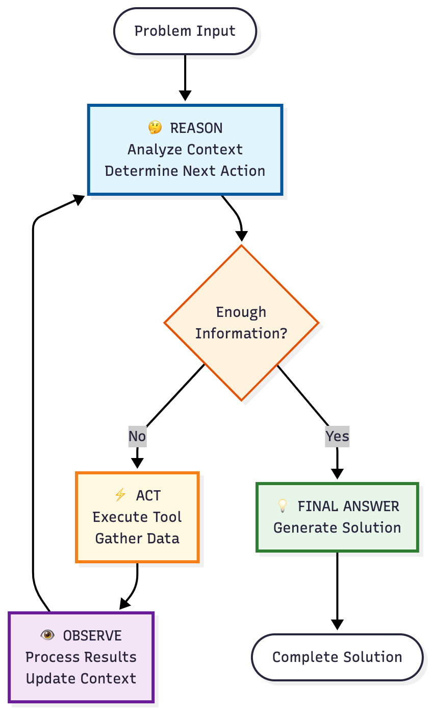

# Lesson 2: Chain-of-Thought and ReACT Prompting

## Learning Objectives
Master advanced reasoning techniques by implementing Chain-of-Thought (CoT) prompting and ReACT framework patterns to solve complex business problems with multi-step reasoning and tool integration.

## What You'll Learn
- Design Chain-of-Thought prompts for step-by-step reasoning
- Implement ReACT (Reason, Act, Observe) patterns with Vertex AI Gemini
- Use function calling for tool integration within ReACT loops
- Compare reasoning quality between standard and CoT approaches
- Build iterative problem-solving workflows with observation feedback

## Lesson Structure
This lesson consists of two main exercises that build upon each other:

1. **Chain-of-Thought Prompting** (`cot_prompting.py`)
   - Implement step-by-step reasoning for complex problems
   - Build prompts that show reasoning process
   - Validate reasoning chains for accuracy

2. **ReACT Framework Implementation** (`react_agent.py`)
   - Create Reason→Act→Observe loops
   - Integrate Gemini function calling for tool use
   - Build iterative problem-solving agents

## Your Tasks

### Exercise 1: Chain-of-Thought Prompting
Complete **TODOs 1-3** in `cot_prompting.py`:

#### TODO 1: Standard Problem-Solving Prompt
Create a basic prompt that asks Gemini to solve a business problem directly:
- Simple, direct question format
- No reasoning steps required
- Baseline for comparison

#### TODO 2: Chain-of-Thought Prompt
Design an enhanced prompt that guides step-by-step reasoning:
- **Reasoning indicators**: "Let's think step by step", "First, I need to..."
- **Structured breakdown**: Break complex problems into steps
- **Intermediate calculations**: Show work at each stage
- **Clear logic flow**: Connect each step to the next

#### TODO 3: CoT Analysis Implementation
Build analysis that compares reasoning quality:
- Extract reasoning steps from response
- Validate logic chain coherence
- Measure improvement over standard approach
- Calculate confidence in final answer

### Exercise 2: ReACT Framework
Complete **TODOs 4-6** in `react_agent.py`:

#### TODO 4: Reasoning Step Implementation
Create the "Reason" phase of ReACT:
- Analyze current state and context
- Determine what information is needed
- Plan next action based on observations
- Format: "I need to [action] because [reasoning]"

#### TODO 5: Action Execution with Tools
Implement the "Act" phase with function calling:
- Define tool functions (calculator, market_data, competitor_analysis)
- Execute appropriate tool based on reasoning
- Handle tool responses properly
- Use Gemini function calling when available

#### TODO 6: Observation Integration
Build the "Observe" and iterate logic:
- Process tool results into observations
- Update context with new information
- Determine if goal is achieved
- Loop back to reasoning if needed
- Maximum 5 iterations for safety

## Implementation Guidelines

### Chain-of-Thought Best Practices
```python
# TODO 2 Example Structure
COT_PROMPT_TEMPLATE = """
You are solving a complex business problem. Think through this step-by-step.

Problem: {problem}

Let's approach this systematically:
1. First, identify what we need to calculate
2. Break down the problem into manageable steps
3. Show all calculations and reasoning
4. Validate the logic at each step
5. Arrive at a final conclusion

Begin your step-by-step analysis:
"""
```

### ReACT Pattern Structure
```python
# TODO 4-6 Framework
class ReACTAgent:
    def solve(self, problem: str) -> str:
        context = {"problem": problem, "observations": []}
        
        for iteration in range(MAX_ITERATIONS):
            # TODO 4: Reason about next step
            reasoning = self.reason(context)
            
            # TODO 5: Execute action with tools
            action_result = self.act(reasoning)
            
            # TODO 6: Observe and update context
            observation = self.observe(action_result)
            context["observations"].append(observation)
            
            if self.is_complete(context):
                return self.format_solution(context)
                
        return "Max iterations reached"
```

### Function Calling Integration
```python
# Tool definitions for Gemini function calling
tools = [
    {
        "name": "calculate",
        "description": "Perform mathematical calculations",
        "parameters": {
            "type": "object",
            "properties": {
                "expression": {"type": "string", "description": "Math expression"}
            }
        }
    },
    {
        "name": "get_market_data",
        "description": "Retrieve market analysis data",
        "parameters": {
            "type": "object",
            "properties": {
                "metric": {"type": "string", "enum": ["size", "growth", "share"]}
            }
        }
    }
]
```

## 🧪 Testing Your Work

### Quick Test
```bash
# Test Chain-of-Thought implementation
python cot_prompting.py

# Test ReACT framework
python react_agent.py
```

### Comprehensive Test
```bash
# Run full test suite with detailed feedback
python test_reasoning.py --verbose

# Test specific components
python test_reasoning.py --component cot      # Test CoT only
python test_reasoning.py --component react    # Test ReACT only
python test_reasoning.py --component compare  # Compare approaches
```

## Success Criteria

### Chain-of-Thought Requirements
- ✅ **Reasoning steps identified**: ≥3 clear steps in response
- ✅ **Logic validation passing**: Each step follows from previous
- ✅ **Improved accuracy**: ≥20% better than standard prompt
- ✅ **Clear explanations**: Reasoning is understandable

### ReACT Framework Requirements
- ✅ **Complete loops**: Successfully completes Reason→Act→Observe
- ✅ **Tool integration**: Function calling works correctly
- ✅ **Convergence**: Reaches solution within 5 iterations
- ✅ **Context management**: Maintains state across iterations

## 💡 Tips for Success

### 1. Chain-of-Thought Prompting
- **Use explicit markers**: "Step 1:", "Step 2:", etc.
- **Show calculations**: Don't just give final answers
- **Connect steps**: Use "Therefore", "This means", "Based on"
- **Validate logic**: Check if steps make sense together

### 2. ReACT Implementation
- **Clear reasoning**: State WHY each action is needed
- **Tool selection**: Choose appropriate tool for the task
- **Observation quality**: Extract key information from results
- **Iteration control**: Know when to stop iterating

### 3. Common Patterns
```python
# Good CoT prompt structure
"Let's solve this step by step:
Step 1: Identify the key variables...
Step 2: Calculate the initial values...
Step 3: Apply the business logic...
Therefore, the final answer is..."

# Good ReACT reasoning
"Current state: I have X information
Goal: I need to find Y
Next action: Use tool Z to get missing data
Reasoning: This will help because..."
```

## Example Output

### Chain-of-Thought Example
```
Problem: Calculate market opportunity for entering Asian markets

Standard Response: "The market opportunity is approximately $50M"

CoT Response: 
"Let's analyze this step by step:

Step 1: Identify target countries in Asia
- Primary markets: Japan, South Korea, Singapore
- Population: 184M combined

Step 2: Calculate TAM (Total Addressable Market)
- Average spending per capita: $500
- TAM = 184M × $500 = $92B

Step 3: Determine SAM (Serviceable Addressable Market)
- Our segment represents 10% of TAM
- SAM = $92B × 0.10 = $9.2B

Step 4: Estimate SOM (Serviceable Obtainable Market)
- Realistic market share Year 1: 0.5%
- SOM = $9.2B × 0.005 = $46M

Therefore, the market opportunity is $46M in Year 1, with potential 
to grow to $184M by Year 3 assuming 2% market share."
```

### ReACT Framework Example
```
Iteration 1:
REASON: I need market size data to calculate opportunity
ACTION: get_market_data(metric="size")
OBSERVE: Asian market size is $92B total

Iteration 2:
REASON: I need growth rates to project future opportunity
ACTION: get_market_data(metric="growth")
OBSERVE: Market growing at 15% annually

Iteration 3:
REASON: I need competitive data to estimate obtainable share
ACTION: get_competitor_analysis()
OBSERVE: Top 3 competitors have 60% share combined

Final Solution: Based on market size ($92B), growth (15%), and 
competitive landscape, estimated opportunity is $46M Year 1...
```

## 🎉 What's Next?

After completing this lesson successfully:
1. **Review your implementations** - Ensure reasoning is clear
2. **Compare approaches** - Understand when to use each technique
3. **Test edge cases** - Try with different problem types
4. **Move to Lesson 3** - Prompt Optimization with Vertex AI

## 🆘 Getting Help

### Common Issues:
- **"No reasoning steps found"** → Use explicit step markers in prompts
- **"ReACT loop doesn't converge"** → Check termination conditions
- **"Function calling fails"** → Verify tool definitions match schema
- **"Context lost between iterations"** → Ensure proper state management

### Debug Tips:
```python
# Add logging to track reasoning
print(f"Iteration {i}: Reasoning = {reasoning}")
print(f"Action taken: {action}")
print(f"Observation: {observation}")

# Validate CoT steps
steps = extract_reasoning_steps(response)
print(f"Found {len(steps)} reasoning steps")
```

---

**Remember**: Chain-of-Thought and ReACT are powerful techniques for complex problem-solving. Focus on clear reasoning, proper tool integration, and iterative improvement! 

# ReACT Loop


