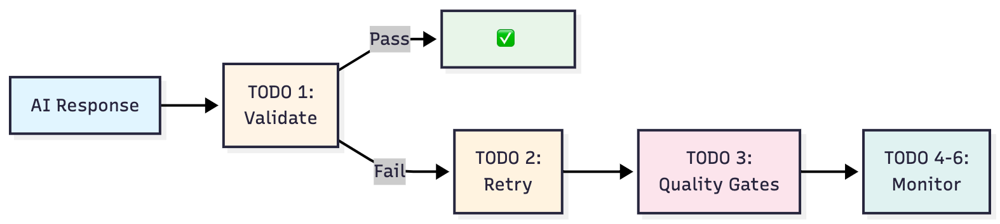
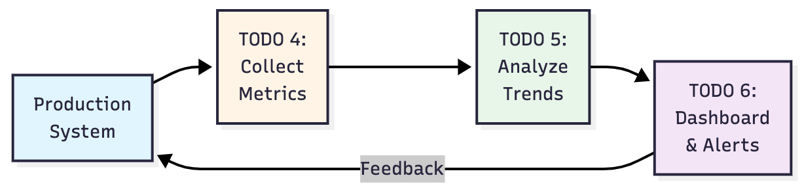

# Lesson 5: Feedback Loops and Iterative Improvement

## Learning Objectives
Master advanced feedback loop systems and iterative improvement techniques to build self-correcting, production-ready AI agents that continuously optimize their performance through systematic monitoring, validation, and refinement cycles.

## What You'll Learn
- Design and implement self-correcting AI systems with automated error detection
- Build comprehensive quality validation loops with confidence scoring
- Create performance monitoring systems with real-time analytics and alerting
- Develop iterative refinement mechanisms that improve over time
- Implement production-grade monitoring dashboards and feedback integration
- Understand enterprise deployment patterns for AI system monitoring

## Lesson Structure
This capstone lesson integrates all previous lessons to create sophisticated production systems:

1. **Self-Validation Systems** (`self_validator.py`)
   - Automated error detection and confidence scoring
   - Quality assessment with improvement recommendations
   - Self-correction mechanisms with fallback strategies

2. **Iterative Improvement Engine** (`improvement_engine.py`)
   - Automatic retry loops with learning integration
   - Performance tracking and optimization cycles
   - Feedback-driven prompt and parameter adjustment

3. **Production Monitoring Suite** (`monitoring_dashboard.py`)
   - Real-time performance analytics and alerting
   - Comprehensive metrics collection and analysis
   - Production deployment monitoring and diagnostics

## Your Tasks

### Exercise 1: Self-Validation and Error Detection
Complete **TODOs 1-27** in `self_validator.py`:

#### TODO 1: Self-Validation Framework
Implement comprehensive self-assessment capabilities:
- **Confidence Scoring**: Multi-dimensional confidence assessment
- **Error Detection**: Automated identification of quality issues
- **Content Validation**: Coherence, relevance, and completeness checking
- **Threshold Management**: Dynamic quality thresholds based on context

#### TODO 2: Automatic Retry and Refinement
Create intelligent retry mechanisms:
- **Retry Logic**: Smart retry with parameter adjustment
- **Improvement Tracking**: Monitor refinement effectiveness
- **Learning Integration**: Incorporate feedback into future attempts
- **Escalation Paths**: Handle persistent failures gracefully

#### TODO 3: Quality Gate Systems
Build comprehensive quality control:
- **Multi-Level Gates**: Different validation levels for different use cases
- **Escalation Workflows**: Automatic escalation for quality failures
- **Fallback Strategies**: Alternative approaches when primary methods fail
- **Performance Integration**: Connect quality gates to performance metrics

### Exercise 2: Iterative Improvement Engine
Complete **TODOs 4-30** in `improvement_engine.py`:

#### TODO 4: Performance Analytics System
Implement sophisticated performance tracking:
- **Metrics Collection**: Comprehensive performance data gathering
- **Trend Analysis**: Identify performance patterns and degradation
- **Alerting System**: Real-time alerts for performance issues
- **Optimization Recommendations**: AI-driven improvement suggestions

#### TODO 5: Continuous Learning Integration
Create feedback-driven learning systems:
- **Feedback Processing**: Structured feedback collection and analysis
- **Model Adaptation**: Dynamic adjustment based on performance data
- **Historical Analysis**: Long-term performance trend analysis
- **Predictive Optimization**: Proactive performance improvement

#### TODO 6: Production Monitoring Dashboard
Build enterprise-grade monitoring:
- **Real-Time Metrics**: Live performance dashboards with key indicators
- **Health Monitoring**: System health checks and diagnostic reporting
- **Cost Analytics**: Token usage, cost tracking, and optimization insights
- **Integration Testing**: Validate all lesson components working together

## 📝 Implementation Guidelines

### Self-Validation Architecture (TODOs 1-3)
```python
class SelfValidator:
    def validate_response(self, response: str, context: ValidationContext) -> ValidationResult:
        # TODO 1: Implement comprehensive self-validation
        confidence_scores = self._calculate_confidence_scores(response, context)
        error_detection = self._detect_errors(response, context)
        quality_assessment = self._assess_quality(response, context)
        
        return ValidationResult(
            overall_confidence=confidence_scores.overall,
            detected_issues=error_detection.issues,
            quality_metrics=quality_assessment.metrics,
            improvement_recommendations=self._generate_recommendations(response, context)
        )
    
    def auto_retry_with_improvement(self, failed_attempt: FailedAttempt) -> RetryResult:
        # TODO 2: Implement intelligent retry mechanism
        adjusted_parameters = self._adjust_parameters(failed_attempt)
        improved_prompt = self._enhance_prompt(failed_attempt)
        retry_strategy = self._select_retry_strategy(failed_attempt)
        
        return self._execute_retry(improved_prompt, adjusted_parameters, retry_strategy)
```

### Performance Analytics Framework (TODOs 4-6)
```python
class PerformanceAnalytics:
    def collect_metrics(self, operation: Operation, result: Result) -> MetricsCollection:
        # TODO 4: Implement comprehensive metrics collection
        return MetricsCollection(
            quality_metrics=self._collect_quality_metrics(result),
            performance_metrics=self._collect_performance_metrics(operation),
            cost_metrics=self._collect_cost_metrics(operation),
            user_feedback=self._collect_feedback_metrics(result)
        )
    
    def analyze_trends(self, metrics_history: List[MetricsCollection]) -> TrendAnalysis:
        # TODO 5: Implement trend analysis and learning
        trends = self._identify_trends(metrics_history)
        anomalies = self._detect_anomalies(metrics_history)
        recommendations = self._generate_optimization_recommendations(trends, anomalies)
        
        return TrendAnalysis(trends=trends, anomalies=anomalies, recommendations=recommendations)
    
    def generate_dashboard(self, real_time_data: RealTimeData) -> MonitoringDashboard:
        # TODO 6: Implement production monitoring dashboard
        return MonitoringDashboard(
            live_metrics=self._format_live_metrics(real_time_data),
            health_status=self._calculate_system_health(real_time_data),
            alerts=self._generate_alerts(real_time_data),
            performance_insights=self._analyze_performance(real_time_data)
        )
```

### Cross-Lesson Integration Patterns
```python
# Integrate with previous lessons
from lesson_1_personas import PersonaManager
from lesson_2_reasoning import CoTAgent, ReACTAgent  
from lesson_3_optimization import VertexPromptOptimizer
from lesson_4_chaining import BusinessIntelligenceChain

class ProductionAISystem:
    def __init__(self, project_id: str):
        # Initialize all lesson components
        self.persona_manager = PersonaManager(project_id)
        self.optimizer = VertexPromptOptimizer(project_id)
        self.bi_chain = BusinessIntelligenceChain(project_id)
        
        # Add Lesson 5 components
        self.validator = SelfValidator(project_id)
        self.improvement_engine = ImprovementEngine(project_id)
        self.analytics = PerformanceAnalytics(project_id)
    
    def generate_report_with_feedback_loops(self, scenario: BusinessScenario) -> ProductionReport:
        # Complete pipeline with all feedback loops
        for attempt in range(self.max_attempts):
            report = self.bi_chain.generate_complete_report(scenario)
            validation = self.validator.validate_response(report.content, scenario)
            
            if validation.meets_quality_threshold():
                self.analytics.record_success(report, validation)
                return ProductionReport(report=report, validation=validation, attempts=attempt+1)
            
            # Implement feedback loop
            improvement = self.improvement_engine.analyze_failure(report, validation)
            self.bi_chain.apply_improvements(improvement)
        
        return self._handle_max_attempts_exceeded(scenario)
```

## 🧪 Testing Your Work

### Environment Setup
```bash
# Complete system integration testing
export PROJECT_ID=your-gcp-project-id
export MONITORING_ENABLED=true
export FEEDBACK_LOOPS_ACTIVE=true

# Verify all lesson integrations
python -c "
from lesson_1_personas import PersonaManager
from lesson_2_reasoning import CoTAgent
from lesson_3_optimization import VertexPromptOptimizer
from lesson_4_chaining import BusinessIntelligenceChain
from self_validator import SelfValidator
print('✅ All lesson integrations ready')
"
```

### Self-Validation Testing
```bash
# Test self-validation system
python self_validator.py --test-confidence-scoring

# Test retry mechanisms
python self_validator.py --test-retry-logic --scenarios business

# Test quality gates
python self_validator.py --test-quality-gates --validation-level strict
```

### Performance Analytics Testing
```bash
# Test metrics collection
python improvement_engine.py --test-metrics-collection

# Test trend analysis
python improvement_engine.py --test-trend-analysis --historical-data

# Test production monitoring
python improvement_engine.py --test-monitoring-dashboard --real-time
```

### Complete System Integration
```bash
# Test full production system
python test_feedback_loops.py --verbose

# Test specific TODOs
python test_feedback_loops.py --todo 25  # Self-validation
python test_feedback_loops.py --todo 28  # Performance analytics
python test_feedback_loops.py --todo 30  # Production monitoring

# Integration test across all lessons
python test_feedback_loops.py --integration --all-lessons
```

## 📊 Success Criteria

### Self-Validation Systems (TODOs 1-3)
- ✅ **Confidence scoring accuracy ≥ 85%** for quality prediction
- ✅ **Error detection rate ≥ 90%** for common failure modes
- ✅ **Retry success rate ≥ 75%** for recoverable failures
- ✅ **Quality gate effectiveness** measurable improvement in output quality

### Performance Analytics (TODOs 4-6)
- ✅ **Real-time monitoring** with <100ms dashboard update latency
- ✅ **Trend detection accuracy** identifying performance degradation
- ✅ **Alert system reliability** with minimal false positives
- ✅ **Complete lesson integration** seamless workflow across all 5 lessons

## 💡 Tips for Success

### 1. Self-Validation Best Practices
```python
# Effective confidence scoring
class ConfidenceScorer:
    def calculate_confidence(self, response: str, context: Context) -> ConfidenceScore:
        # Multi-dimensional confidence assessment
        content_confidence = self._assess_content_quality(response)
        context_confidence = self._assess_context_relevance(response, context)
        consistency_confidence = self._assess_internal_consistency(response)
        
        return ConfidenceScore.weighted_average([
            (content_confidence, 0.4),
            (context_confidence, 0.3),
            (consistency_confidence, 0.3)
        ])
```

### 2. Effective Retry Strategies
- **Progressive Enhancement**: Incrementally improve prompts and parameters
- **Context Preservation**: Maintain learning across retry attempts
- **Failure Analysis**: Learn from specific failure patterns
- **Resource Management**: Balance quality improvement with computational cost

### 3. Production Monitoring Patterns
```python
# Comprehensive monitoring setup
class ProductionMonitor:
    def setup_monitoring(self):
        self.quality_monitors = [
            QualityThresholdMonitor(threshold=0.8),
            ResponseTimeMonitor(max_time=5.0),
            CostEfficiencyMonitor(max_cost_per_request=0.05),
            UserSatisfactionMonitor(min_satisfaction=4.0)
        ]
        
        self.alerting_rules = [
            AlertRule("quality_degradation", lambda m: m.quality_trend < -0.1),
            AlertRule("cost_spike", lambda m: m.cost_increase > 0.5),
            AlertRule("system_errors", lambda m: m.error_rate > 0.05)
        ]
```

### 4. Continuous Improvement Framework
- **Feedback Integration**: Systematic incorporation of user feedback
- **A/B Testing**: Compare different approaches with statistical validation
- **Performance Benchmarking**: Regular comparison against baseline metrics
- **Iterative Optimization**: Continuous refinement based on production data

## 🔍 Example Production System

### Complete Feedback Loop Workflow
```
1. Request Processing
   ├─ Input Validation (Quality Gates)
   ├─ Persona Selection (Lesson 1)
   ├─ Reasoning Strategy (Lesson 2 - CoT/ReACT)
   ├─ Prompt Optimization (Lesson 3)
   └─ Chain Execution (Lesson 4)

2. Self-Validation (NEW)
   ├─ Confidence Scoring
   ├─ Error Detection
   ├─ Quality Assessment
   └─ Improvement Recommendations

3. Iterative Refinement (NEW)
   ├─ Failure Analysis
   ├─ Parameter Adjustment
   ├─ Retry with Enhancement
   └─ Learning Integration

4. Performance Monitoring (NEW)
   ├─ Metrics Collection
   ├─ Trend Analysis
   ├─ Real-time Alerting
   └─ Dashboard Updates

5. Continuous Improvement (NEW)
   ├─ Feedback Processing
   ├─ System Optimization
   ├─ Predictive Maintenance
   └─ Performance Reporting
```

### Production Metrics Dashboard
```
📊 Live Performance Dashboard

System Health: 🟢 Operational (99.2% uptime)
Quality Score: 0.87 (Target: ≥0.80) ↗️ +0.03
Response Time: 1.8s (Target: ≤3.0s) ↗️ -0.2s
Cost Efficiency: $0.023/request (Target: ≤$0.05) ↘️ -$0.007
User Satisfaction: 4.3/5.0 (Target: ≥4.0) ↗️ +0.1

Recent Improvements:
✅ Prompt optimization reduced token usage by 15%
✅ Quality gate implementation improved output quality by 12%
✅ Retry logic decreased failure rate by 8%

Active Alerts: None 🎉
Next Optimization: Scheduled for tonight at 2 AM UTC
```

## 🎉 What's Next?

After completing this capstone lesson successfully:
1. **Deploy to Production** - Your system is ready for real-world deployment
2. **Monitor and Optimize** - Use the monitoring systems to continuously improve
3. **Scale and Extend** - Apply these patterns to other AI use cases
4. **Share Your Success** - Demonstrate your production-ready AI system

## 🆘 Getting Help

### Common Issues:
- **"Confidence scores inconsistent"** → Validate scoring algorithms with test data
- **"Retry loops not improving"** → Check parameter adjustment strategies
- **"Monitoring dashboard not updating"** → Verify real-time data pipeline
- **"Cross-lesson integration failing"** → Test individual lesson components first

### Debug Production Issues:
```python
# Comprehensive system diagnostics
class SystemDiagnostics:
    def run_full_diagnostic(self):
        results = {
            "lesson_1_personas": self.test_persona_manager(),
            "lesson_2_reasoning": self.test_cot_react_agents(),
            "lesson_3_optimization": self.test_prompt_optimizer(),
            "lesson_4_chaining": self.test_bi_chain(),
            "lesson_5_feedback": self.test_feedback_loops()
        }
        
        return DiagnosticReport(results)
```

### Resources:
- Review production AI system monitoring best practices
- Study feedback loop implementation patterns in enterprise systems
- Examine A/B testing frameworks for AI system optimization

---

## **Production-Ready AI System Mastery**

### Self-Validation System Architecture (Part A)


### Monitoring Pipeline (Part B)



**Before**: Individual AI components with manual monitoring  
**After**: Sophisticated self-improving AI systems with automated feedback loops

**Key Benefits**:
- Master enterprise-grade AI system monitoring and optimization
- Build self-correcting systems that improve over time
- Develop production deployment and maintenance expertise
- Create comprehensive feedback-driven improvement workflows
